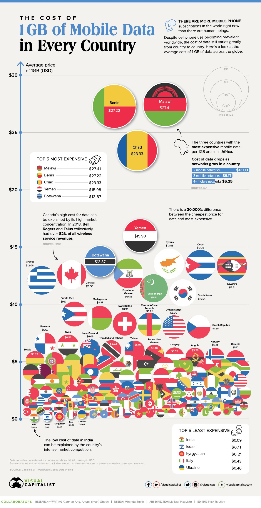
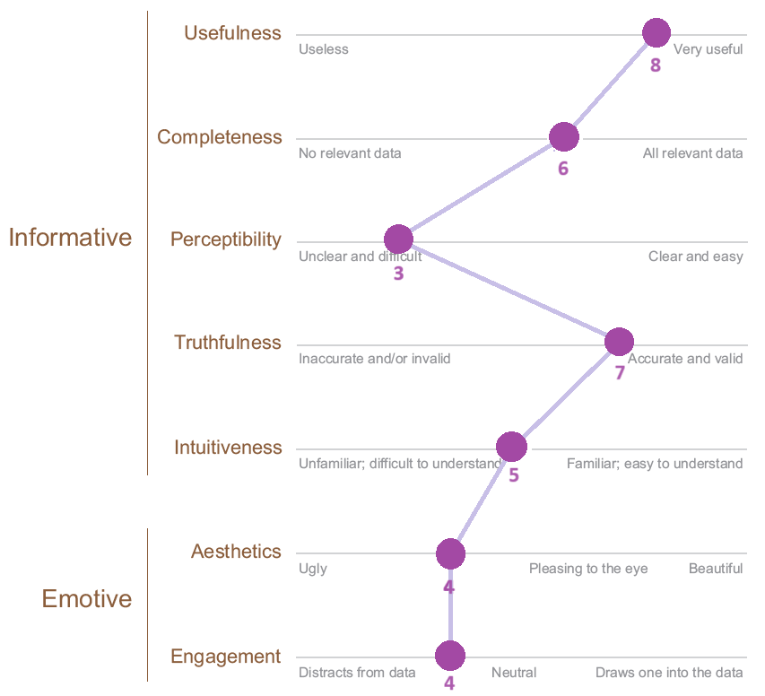

| [home page](README.md) | [visualizing debt](visualizing-government-debt) | [critique by design](critique-by-design) | [final project I](final-project-part-one) | [final project II](final-project-part-two) | [final project III](final-project-part-three) |

# Critique by Design

## Step 1: Choosing a Data Visualization

For this assignment, we were asked to select a data visualization to critique and re-design. Per the professor's suggestion, I selected my data visualization from the [Makeover Monday website](https://makeovermonday.co.uk/).

I selected the visualization ["The Cost of 1GB of Mobile Data in Every Country?"](https://www.visualcapitalist.com/cost-of-mobile-data-worldwide/) which was published July 2020 via Visual Capitalist.

Having spent a substantial amount of time abroad in Spain and Italy, I was interested in the subject of this data visualization. When I lived in Spain (2017-2019), I was paying 15 euros (about 16 USD) a month for a phone plan with 10GB of data. However, when I recently lived in Italy (2022), I was paying 12 euros (about 12 USD) a month for 150GB of data. Personally, I was shocked by the stark difference and I've been wondering about the cost of mobile data ever since. Hence, I was instantly interested in this data visualization. (And imagine my surprise when one of the call-out boxes listed Italy as one of the 5 least expensive countries for 1GB!)

## Step 2: Critique the Visualization

For this critique, we utilized Stephen Few's [Data Visualization Effectiveness Profile Technique](https://www.perceptualedge.com/articles/visual_business_intelligence/data_visualization_effectiveness_profile.pdf).

Here is how I scored the data visualization along each of the seven criteria: 

**Overall Observations:** While ranked high in the area of usefulness, this visualization was too cluttered and not intuitive enough to gain it high scores in other areas. I think this data was useful amongst a wide audience (e.g., consumers, tech companies, and policymakers), especially in 2020 when the pandemic highlighted disparities compounding the tech gap crisis. The second-highest ranking was in the area of truthfulness as it seems that the size differences were representative of the price differences (e.g., the size of Benin and Malawi isn’t very different and neither are their prices). However, the fact that the majority of the country data was under $5 made it very difficult to determine if they were well-positioned. Furthermore, forcing the audience to compare sizes is difficult and decreases perceptibility and clarity. It was hard to 1) tell the difference between similar-sized countries (especially without price/country labels), 2) locate countries, or 3) track regional trends. The use of flags as icons was also not very intuitive as viewers unlikely know the flag for each country. The things that worked really well were actually the callout boxes and captions as I felt that they highlighted some of the data’s main points (e.g., least/most expensive countries, regional trends, and disparity levels). Also, the size key and the y-axis labels were helpful (and necessary) in contextualizing how much 1GB cost in each country.

**Intended Audience:** Given the aesthetic choices made, I assume that the creator intended this visualization to be for a generalized audience. It seems that the creator tried to be creative with the data to entice people who may not be familiar with the topic/data to learn more about the issue. However, I do not think that the visualization is effective because it sacrifices the informative criteria of a visualization for the emotive criteria. Any viewer, even those with more association to the topic/data would have had a difficult time identifying countries, price differences, and regional trends. So, while the audience may find it visually appealing, I do not think that they would actually engage with the data or be encouraged to learn more about the issue. So, while the information could be important for consumers, policymakers, or tech companies, it’s unlikely that it will actually result in any outcome that could resolve the tech gap created by price disparities for data.

**Thoughts on The Effectiveness Profile Technique:** This critique method challenged me to think more deeply about different aspects of the visualization. Splitting elements into informative and emotive categories was also really useful for the visualization I selected because I was able to see how sometimes choosing to focus on emotive categories can come at the expense of the informative elements. When discussing his ranges for the different characteristics, Few discusses how there is more leeway for emotive elements than informative ones, and this visualization would have been more effective if the design were more familiar (e.g., a heat map or even a bar graph) – especially because the data was useful to a broad audience. I don’t think the Few critique method misses anything, but I do think it takes practice to really understand the differences between the criteria as some might seem to overlap at first. For instance, I was struggling to determine if the flag circle icons were more of a perceptibility issue or an intuitiveness issue. For instance, the size comparison was perceptibility while the flag icon was about intuitiveness; however, there is some overlap so it’s difficult to rank various criteria. 

## Step 3: Sketch the Redesign

After critiquing the original data visualization, I had two recommendations for a redesign: 

**1) change the chart type to be a map**
A map layout would be a more intuitive chart type for viewers. It would also present the data in a way that limits clutter and illustrates country differences and regional trends.

**2) use a diverging color scheme** 
This change would maintain the original design's focus on the comparison between countries with the highest cost and countries with the lowest cost.

With these two recommendations in mind, I decided to utilize Tableau for the first draft of my redesign. 

<noscript></noscript><object class='tableauViz'  style='display:none;'><param name='host_url' value='https%3A%2F%2Fpublic.tableau.com%2F' /> <param name='embed_code_version' value='3' /> <param name='site_root' value='' /><param name='name' value='Costsof1GBbyCountry&#47;Sheet1' /><param name='tabs' value='no' /><param name='toolbar' value='yes' /><param name='static_image' value='https:&#47;&#47;public.tableau.com&#47;static&#47;images&#47;Co&#47;Costsof1GBbyCountry&#47;Sheet1&#47;1.png' /> <param name='animate_transition' value='yes' /><param name='display_static_image' value='yes' /><param name='display_spinner' value='yes' /><param name='display_overlay' value='yes' /><param name='display_count' value='yes' /><param name='language' value='en-US' /></object>

 

## Step 4: Test the Solution

## Step 5: Build the Re-design
